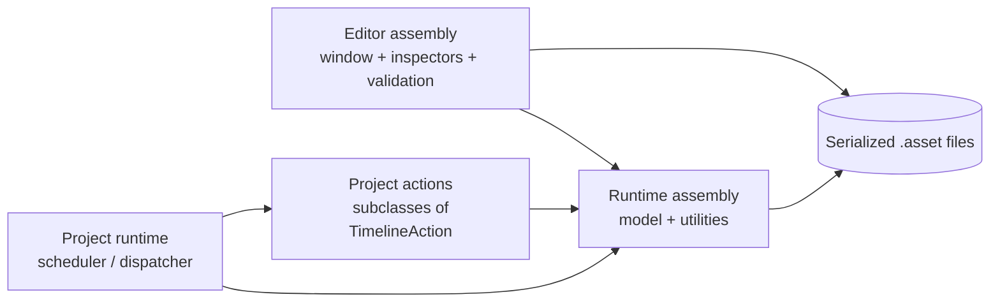
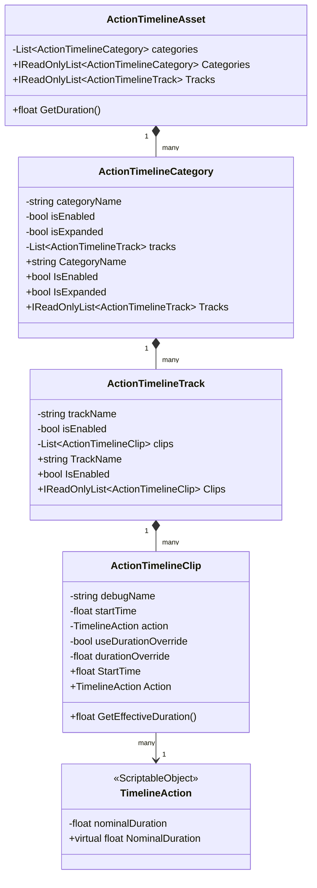
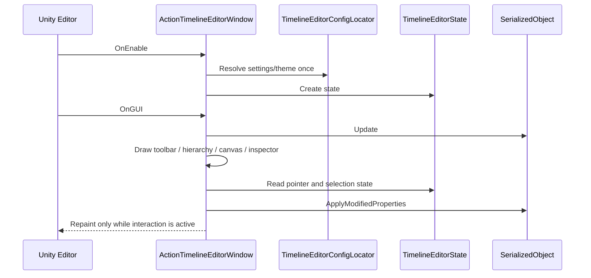
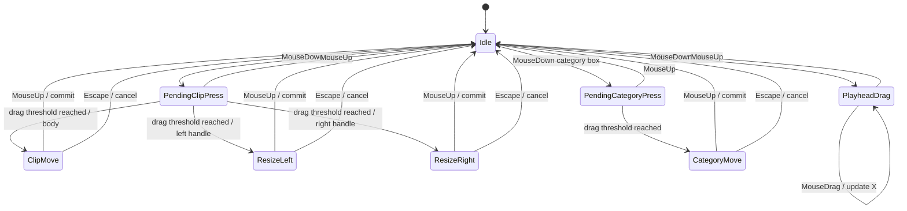
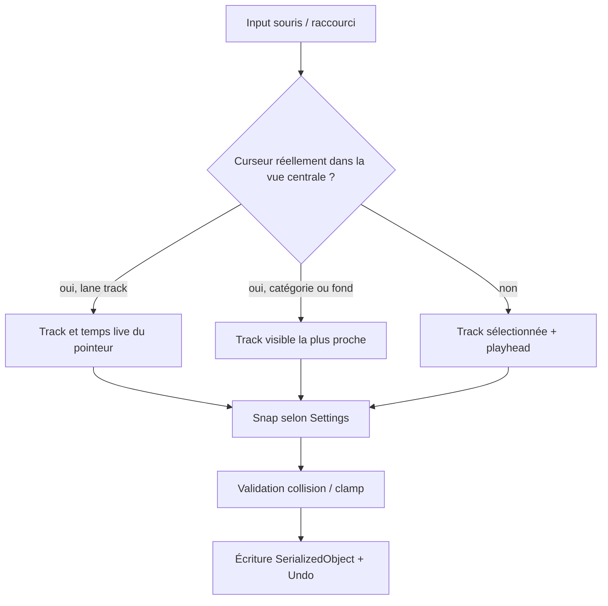
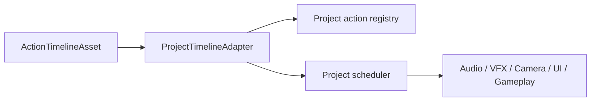

# Action Timeline — architecture technique réutilisable

Ce document décrit les décisions d’architecture du package et la manière de le réutiliser dans un autre projet Unity. Il complète `ActionTimeline.md`, qui est la documentation orientée auteur.

## 1. Contrat architectural

Le package sépare quatre responsabilités :

1. **Données d’authoring** : assets et classes sérialisables du dossier `Runtime/`.
2. **Règles génériques** : durée, chevauchement et validité.
3. **Outils Unity Editor** : fenêtre, inspecteurs, sélection, manipulation et configuration.
4. **Exécution projet** : volontairement laissée à l’intégrateur.



### Assemblies

`Beardmage.ActionTimeline.Runtime` ne référence aucune autre assembly du package et peut être incluse dans les builds. `Beardmage.ActionTimeline.Editor` est limité à la plateforme `Editor` et référence l’assembly runtime.

Cette séparation évite que `UnityEditor`, les classes de fenêtre ou l’index d’usage contaminent le runtime du jeu.

## 2. Modèle sérialisé et vue aplatie



La seule collection sérialisée à la racine est `categories`. `ActionTimelineAsset.Tracks` reconstruit une liste aplatie en mémoire, dans l’ordre catégorie puis track. Cette vue est pratique pour les consommateurs simples et la validation ; elle ne doit pas être traitée comme une collection sérialisée ou comme un identifiant stable.

### Invariants recommandés

| Invariant | Garant | Conséquence intégrateur |
| --- | --- | --- |
| Un début de clip est positif | `Min(0)` et éditeur | Un runtime peut utiliser `StartTime` directement. |
| Une durée effective est positive ou nulle | action ou override | Les clips ponctuels restent représentables. |
| Une catégorie peut contenir plusieurs tracks | modèle sérialisé | Les tracks parallèles sont indépendantes. |
| Une catégorie/track peut être désactivée sans suppression | `IsEnabled` | Le runtime doit filtrer les branches inactives. |
| Les références d’action sont partagées | `ScriptableObject` | Le paste ne clone pas les assets d’action. |

## 3. Sémantique temporelle

Les fonctions centrales sont dans `TimelineDurationUtility` :

```text
effectiveDuration(clip) =
    clip.UseDurationOverride
        ? max(0, clip.DurationOverride)
        : max(0, clip.Action.NominalDuration)

end(clip) = max(0, clip.StartTime) + effectiveDuration(clip)
```

`ActionTimelineAsset.GetDuration()` prend le maximum des fins de clips valides appartenant à une catégorie et une track activées. Un clip sans action est ignoré pour cette durée.

### Chevauchement

`TimelineOverlapUtility` travaille avec des intervalles temporels :

- les durées positives utilisent un intervalle semi-ouvert avec une petite epsilon ;
- deux clips ponctuels de même instant se chevauchent ;
- un clip ponctuel est considéré comme chevauchant un intervalle lorsqu’il tombe sur son bord ou à l’intérieur ;
- `CanPlaceClipInTrack` ignore éventuellement un index de clip, utile lors d’un déplacement ou d’un resize.

Cette règle est volontairement générique. Un projet peut autoriser les chevauchements dans son runtime, mais l’éditeur les signale comme erreur de validation afin de conserver une lane lisible.

## 4. Cycle de vie de la fenêtre Editor



Le locator ne fait pas de recherche `AssetDatabase` à chaque repaint. Il résout les assets actifs une fois par session et invalide explicitement son cache lors d’une activation ou d’une création. La fenêtre peut donc être redessinée à chaque mouvement de souris sans scanner le projet.

### Source de vérité Settings/Theme

Chaque asset possède un flag sérialisé d’activation, masqué dans l’inspecteur standard et piloté par `Set as Active`. Le locator :

1. cherche un asset actif ;
2. s’il n’en trouve pas mais qu’un asset existe, active le premier ;
3. s’il n’en trouve aucun, utilise un fallback mémoire ;
4. crée un asset persistant uniquement lorsqu’un bouton `Settings` ou `Theme` est utilisé.

Le Theme alimente les couleurs et dimensions via `TimelineEditorStyles`. Les Settings alimentent les seuils de drag, le snap, les raccourcis, le zoom et les options de sélection.

## 5. Machine d’état d’interaction

La fenêtre conserve l’état transitoire dans `TimelineEditorState`. Les données persistantes restent dans le `SerializedObject` de la timeline.



### Move d’un clip

1. Le `MouseDown` identifie le corps ou un handle.
2. L’offset temporel exact entre la souris et le bord manipulé est conservé.
3. Le déplacement calcule un delta temporel brut.
4. Le delta est clampé pour empêcher un début négatif.
5. Le snap tente les bords des clips non sélectionnés et le playhead.
6. La destination verticale change uniquement sur une track réellement survolée.
7. La prévisualisation vérifie les collisions avec les clips non déplacés et avec le groupe lui-même.
8. Au `MouseUp`, la modification est enregistrée par `Undo` et appliquée au `SerializedObject`.

### Resize d’un clip

Le bord opposé reste fixe. La track source est verrouillée. Le resize peut modifier `startTime` et `durationOverride`, mais ne déplace jamais le clip verticalement et ne change pas de track.

### Move de catégorie

La catégorie calcule une plage d’activité min/max. Le déplacement applique le même delta à tous les clips enfants, clampé à zéro. Le resize proportionnel n’est pas encore dans le contrat.

### Multi-sélection

`TimelineClipKey(trackIndex, clipIndex)` identifie les clips sélectionnés dans l’état éditeur. Le clip primaire sert de référence pour l’inspecteur, le point de prise et la sélection après commit. Lors d’un déplacement groupé, les offsets entre clips sont conservés.

## 6. Flux de placement, snap et collage



Pour `Ctrl/Cmd + V`, le collage utilise le contexte live de la frame courante. Il ne réutilise pas un ancien contexte de souris lorsque le curseur est dans la hiérarchie ou l’inspecteur ; dans ce cas, une track sélectionnée colle au playhead.

Les snapshots de clipboard stockent les données du clip et les références d’action en mémoire dans la fenêtre. Ils ne sont pas sérialisés dans l’asset et sont perdus lors de la fermeture de la fenêtre ou d’un domain reload.

## 7. Validation et diagnostics

`TimelineValidator` produit des `TimelineValidationResult` avec :

- un `RuleId` stable ;
- une sévérité `Info`, `Warning` ou `Error` ;
- un message ;
- un index de track et de clip lorsque le résultat est contextualisé.

Les règles actuelles sont :

```text
TimelineNull
TimelineHasNoTracks
TrackNull
TrackEmpty
TrackDisabledContainsClips
TrackOverlap
ClipNull
ClipMissingAction
ClipNegativeDurationOverride
TimelineHasNoValidEnabledClips
```

Le validateur parcourt la vue aplatie, mais remonte à la catégorie d’origine pour filtrer les clips d’une catégorie désactivée. Une intégration projet peut réutiliser le validateur, filtrer certaines sévérités ou ajouter un validateur complémentaire sans modifier le modèle.

## 8. Réutiliser le package dans un autre projet

### Étape A — définir les actions métier

Créer des sous-classes focalisées sur les données d’intention :

```csharp
[CreateAssetMenu(menuName = "Combat/Timeline Actions/Play Attack")]
public sealed class PlayAttackAction : TimelineAction
{
    [SerializeField] private string attackId;
    [SerializeField] private float duration = 0.9f;

    public string AttackId => attackId;
    public override float NominalDuration => duration;
}
```

Le package ne doit pas connaître `attackId`, les services combat ou les règles de réseau.

### Étape B — choisir une stratégie runtime

Trois stratégies sont compatibles :

1. **Scan simple** : parcourir catégories/tracks/clips à chaque lancement de timeline ; simple et adapté aux petites séquences.
2. **Index précalculé** : aplatir et trier les clips valides à l’import ou au chargement ; adapté aux timelines longues.
3. **Scheduler événementiel** : pousser les clips dans une file ordonnée et les consommer selon une horloge projet ; adapté au jeu, au preview et à l’annulation.

Dans les trois cas, le runtime doit décider quoi faire d’une action manquante, d’une catégorie désactivée et d’un chevauchement.

### Étape C — ajouter l’exécution sans contaminer le package



Un adaptateur projet peut traduire `TimelineAction` en commandes métier. Le package reste réutilisable et testable indépendamment de ces services.

## 9. Points d’extension et limites

### Extensions sûres

- Ajouter des champs sérialisés dans une sous-classe de `TimelineAction`.
- Ajouter une registry runtime dans l’assembly projet.
- Écrire un validateur projet qui consomme `TimelineValidationResult` ou vérifie les actions métier.
- Ajouter des styles de clips via `TimelineActionStyleEntry`.
- Créer un Theme et des Settings projet dédiés, puis les activer.
- Ajouter un outil d’import/export qui transforme un format externe en `ActionTimelineAsset`.

### Extensions à traiter avec précaution

- Modifier la hiérarchie sérialisée nécessite une migration explicite des assets.
- Utiliser les indices aplatis comme identifiants persistants est fragile : insertion ou suppression d’une track les décale.
- Modifier `TimelineAction.NominalDuration` en runtime change la durée de tous les clips qui n’ont pas d’override.
- Autoriser les chevauchements dans l’éditeur demande d’adapter à la fois la validation, le snap et le scheduler.
- Ajouter un polling `AssetDatabase.FindAssets` dans `OnGUI` annulerait le choix d’architecture du locator.

## 10. Checklist d’intégration

```text
[ ] Le package est installé dans Packages/ et les deux asmdefs compilent.
[ ] Les sous-classes TimelineAction ont un CreateAssetMenu et une durée valide.
[ ] Un runtime ou scheduler projet est identifié.
[ ] Les catégories et tracks désactivées ont une sémantique runtime documentée.
[ ] La politique de chevauchement est confirmée.
[ ] Les actions manquantes ont un comportement déterministe.
[ ] Les Settings et Theme actifs sont créés/activés dans le projet.
[ ] Une timeline de test couvre clip ponctuel, override, multi-track et catégorie vide.
[ ] Les raccourcis et le collage sont testés avec la souris dans et hors de la vue centrale.
[ ] Les tests d’Undo/Redo et de domain reload sont passés.
```

## 11. Principes à conserver dans les futures versions

1. Garder les données métier hors du package générique.
2. Garder la sérialisation et la vue aplatie clairement distinctes.
3. Ne jamais modifier une action partagée pendant une opération de clip.
4. Toujours conserver l’offset initial de souris pendant une manipulation.
5. Traiter la validation comme un diagnostic, pas comme un moteur runtime.
6. Résoudre les assets de configuration explicitement et sans polling continu.
7. Ajouter des migrations lorsqu’un champ sérialisé change de sens.
