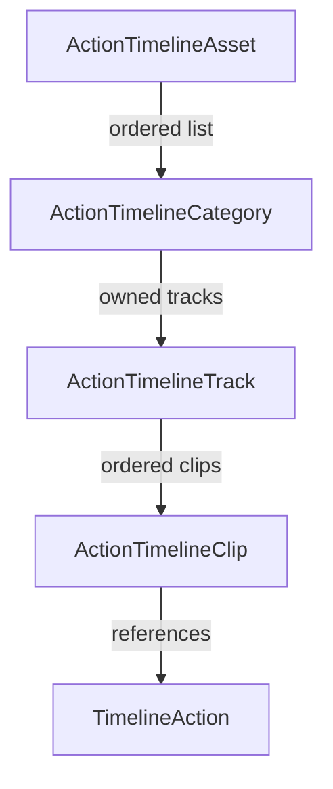

# Action Timeline — guide utilisateur

## 1. À quoi sert ce package ?

Action Timeline est un squelette d’authoring Unity pour décrire des séquences temporelles sous forme d’assets `ScriptableObject`.

Le package fournit :

- une structure `Timeline > Categories > Tracks > Clips` ;
- des actions réutilisables, décrites par une durée nominale ;
- une fenêtre d’édition avec grille, réglette, sélection et drag-and-drop ;
- une validation générique des données ;
- un index des usages d’actions pour retrouver les clips qui les référencent ;
- des assets de Settings et de Theme activables par projet.

Le package ne fournit volontairement pas l’exécution runtime. Il ne sait pas si une action doit jouer un son, déplacer une caméra, afficher une UI, lancer une animation ou déclencher un système propriétaire. Cette séparation permet d’utiliser le même authoring dans plusieurs projets sans imposer de dépendance métier.

## 2. Modèle mental



Une timeline contient une ou plusieurs catégories. Une catégorie regroupe des tracks parallèles. Une track contient des clips ordonnés sur l’axe du temps. Un clip référence une `TimelineAction` et ajoute son positionnement local.

### 2.1 Timeline

`ActionTimelineAsset` est l’asset racine. Il expose :

- `Categories` : la hiérarchie sérialisée ;
- `Tracks` : une vue aplatie en lecture seule, utile aux systèmes qui ne souhaitent pas parcourir les catégories ;
- `GetDuration()` : la durée utile calculée à partir des clips valides et activés.

La sérialisation reste hiérarchique : les tracks ne sont pas stockées dans une seconde liste racine. La vue `Tracks` est reconstruite à la demande pour les validateurs et les intégrations simples.

### 2.2 Category

Une `ActionTimelineCategory` possède :

- `CategoryName` ;
- `IsEnabled` ;
- `IsExpanded` — état de foldout de l’éditeur ;
- `Tracks` — les tracks enfants.

Désactiver une catégorie assombrit sa boîte d’activité et ses clips enfants dans l’éditeur. Pour le calcul de durée et la validation des clips actifs, toute la catégorie est considérée comme inactive.

### 2.3 Track

Une `ActionTimelineTrack` possède :

- `TrackName` ;
- `IsEnabled` ;
- `Clips`.

Désactiver une track ne supprime aucun clip. Les clips restent disponibles pour l’authoring et la validation, mais ils sont assombris dans la vue et ne participent plus au contenu actif de la timeline.

### 2.4 Clip

Un `ActionTimelineClip` contient :

| Champ | Rôle |
| --- | --- |
| `DebugName` | Nom lisible pour l’auteur. |
| `StartTime` | Début local en secondes, toujours ramené à `0` ou plus par l’éditeur. |
| `Action` | Référence vers une `TimelineAction`. |
| `UseDurationOverride` | Active une durée locale pour ce clip. |
| `DurationOverride` | Durée locale utilisée lorsque l’override est actif. |

La durée effective est :

```text
UseDurationOverride
    ? max(0, DurationOverride)
    : max(0, Action.NominalDuration)
```

Redimensionner un clip n’édite jamais l’asset `TimelineAction` référencé. Le resize écrit uniquement les données du clip : `StartTime`, `UseDurationOverride = true` et `DurationOverride`.

### 2.5 Action

`TimelineAction` est une classe `ScriptableObject` générique et créable depuis le menu Unity :

```text
Assets/Create/Action Timeline/Actions/Timeline Action
```

Elle expose une durée nominale :

```csharp
[CreateAssetMenu(menuName = "My Project/Timeline Actions/Move Unit")]
public sealed class MoveUnitAction : TimelineAction
{
    [SerializeField] private float duration = 0.75f;

    public override float NominalDuration => duration;
}
```

Le package ne demande pas que la classe d’action implémente une méthode `Execute`. Le projet consommateur peut ajouter les données métier et un exécuteur indépendant.

## 3. Démarrage rapide

### 3.1 Installer le package

Le package peut être utilisé comme package local UPM ou copié dans le dossier `Packages/` du projet. Les assemblies sont séparées :

- `Beardmage.ActionTimeline.Runtime` : modèle et utilitaires utilisables par le runtime ;
- `Beardmage.ActionTimeline.Editor` : fenêtre, inspecteurs, validation et configuration Unity Editor.

### 3.2 Créer une action

1. Créer une classe qui dérive de `TimelineAction`, ou utiliser directement `TimelineAction` pour un prototype.
2. Créer l’asset de l’action dans le projet.
3. Régler sa durée nominale.

La durée nominale sert de valeur par défaut. Un clip précis peut ensuite la remplacer avec son override local.

### 3.3 Créer une timeline

Utiliser l’un des points d’entrée suivants :

- `Tools/Action Timeline/Create Timeline` ;
- le bouton `Create New Timeline` de la fenêtre ;
- `Assets/Create/Action Timeline/Timeline` via le `CreateAssetMenu` de `ActionTimelineAsset`.

Une timeline neuve contient une catégorie et une track par défaut. Elle peut ensuite être organisée librement.

### 3.4 Ouvrir l’éditeur

Ouvrir `Tools/Action Timeline/Timeline Editor`, puis sélectionner l’asset dans le champ de la toolbar. Depuis les inspecteurs ou l’index d’usage, l’éditeur peut aussi être ouvert directement sur une timeline ou un clip.

### 3.5 Construire une séquence

1. Ajouter des catégories avec `Add Category`.
2. Ajouter une track dans la catégorie sélectionnée.
3. Ajouter un clip avec `Add Clip`, le raccourci `A`, le menu contextuel d’une track ou le clic droit dans la grille.
4. Assigner une `TimelineAction` dans l’inspecteur du clip.
5. Déplacer le clip sur l’axe du temps ; le corps déplace le clip, les bords le redimensionnent.
6. Utiliser la réglette blanche pour définir un repère temporel de travail.

## 4. Interactions de l’éditeur

### Sélection

| Geste | Résultat |
| --- | --- |
| Clic sur la catégorie | Sélectionne la catégorie et son activité. |
| Clic sur la track | Sélectionne la track. `Shift` sélectionne tous ses clips. |
| Clic sur le corps d’un clip | Sélectionne le clip. |
| `Ctrl/Cmd` + clic sur un clip | Ajoute ou retire le clip de la multi-sélection. |
| Clic sur le fond d’une lane | Sélectionne la track ou la timeline selon le contexte. |
| `Esc` | Annule une manipulation en cours ou revient à la sélection timeline. |

Les clips sélectionnés apparaissent en bleu. Le clip primaire de la multi-sélection est conservé pour l’inspecteur et le repositionnement.

### Déplacement et resize

- Le corps d’un clip active le mode `Move`.
- Le bord gauche active `ResizeLeft`.
- Le bord droit active `ResizeRight`.
- Ces modes sont exclusifs dès le `MouseDown`.
- Un resize verrouille la track et ne change que la durée et/ou le début du clip.
- Un déplacement peut changer de track.
- Le point de prise initial sous la souris est conservé.
- Le déplacement groupé conserve les écarts temporels internes.
- La track de destination ne change que lorsque le curseur survole réellement une track valide. Si le curseur quitte les lanes, la dernière track valide reste utilisée.

### Catégories

La boîte d’activité d’une catégorie couvre du premier début de clip au dernier terme de ses tracks enfants. La déplacer décale tous les clips enfants, avec un clamp global à `0s`.

Le resize proportionnel de catégorie n’est pas implémenté dans cette version ; la boîte est uniquement déplaçable.

### Réglette et snap

- Un clic dans la bande des timestamps positionne la réglette blanche.
- Un clic maintenu et déplacé fait suivre la réglette sur l’axe X.
- Les clips et les boîtes de catégorie peuvent s’aligner sur cette réglette lorsque le snap est activé.
- Les clips peuvent également s’aligner sur les bords des autres clips.

### Ajout, copie et collage

`Add Clip` respecte le contexte suivant :

- une track/clip/catégorie/timeline est explicitement sélectionné : ajout au niveau de la réglette ;
- aucune sélection exploitable : ajout à la position X du curseur dans la track survolée, ou dans la track la plus proche.

Pour `Ctrl/Cmd + V` :

- si la souris est dans la vue centrale, le collage utilise sa position X et la track survolée ;
- si une track est sélectionnée mais que la souris est dans la hiérarchie ou l’inspecteur, le collage utilise cette track et la réglette ;
- les clips collés sont sélectionnés automatiquement.

La copie et la duplication fonctionnent pour une catégorie, une track, un clip ou une multi-sélection de clips. Les références d’action sont copiées comme références ; les assets d’action ne sont jamais dupliqués.

## 5. Raccourcis

| Raccourci | Fonction |
| --- | --- |
| `Delete` / `Backspace` | Supprimer la sélection. |
| `T` | Ajouter une track. |
| `A` | Ajouter un clip au repère ou au curseur. |
| `Ctrl/Cmd + C` | Copier catégorie, track ou clip(s). |
| `Ctrl/Cmd + V` | Coller au curseur central, ou au repère pour une track sélectionnée. |
| `Ctrl/Cmd + D` | Dupliquer catégorie, track ou clip(s). |
| `Ctrl/Cmd + clic` | Toggle d’un clip dans la sélection. |
| `Shift` + clic track | Sélectionner tous les clips de la track. |
| Clic/drag dans la réglette | Placer ou déplacer la réglette. |
| `F` | Cadrer la timeline. |
| `Esc` | Annuler la manipulation ou nettoyer la sélection. |

Les raccourcis sont désactivés pendant l’édition de texte lorsque `BlockShortcutsWhileTextEditing` est actif.

## 6. Settings et Theme

Les assets de configuration sont accessibles depuis :

```text
Assets/Create/Action Timeline/Editor/Timeline Editor Settings
Assets/Create/Action Timeline/Editor/Timeline Editor Theme
```

La toolbar contient les boutons `Settings` et `Theme` à droite. Ils pinguent l’asset actif ; si aucun asset n’existe, ils en créent un dans `Assets/` et l’activent.

Chaque asset possède un bouton `Set as Active` dans son inspecteur. Si plusieurs assets existent et qu’aucun n’est actif, le premier trouvé est activé automatiquement lors de la résolution initiale.

### Settings importants

- `DragStartPixelThreshold` : distance avant de transformer un clic en drag ;
- `SnapThresholdPixels` et `EnableSnap` : tolérance et activation du snap ;
- `EnableContextCreateClipHere` : disponibilité du clic droit de création ;
- `SelectTrackOnBackgroundClick` : comportement du clic dans une lane vide ;
- `Default/Min/MaxPixelsPerSecond` : zoom initial et bornes ;
- `EnableKeyboardShortcuts` et les permissions de raccourcis ;
- `ShowBottomAddTrackButton` : footer de création dans la hiérarchie.

### Theme importants

Le Theme contrôle les couleurs de la fenêtre, de la hiérarchie, des lanes, de la grille, des clips, des previews, des warnings et les dimensions principales (`RulerHeight`, `LaneHeight`, `TrackHeaderWidth`, `MinClipVisualWidth`).

Les `TimelineActionStyleEntry` permettent de donner une couleur spécifique à un type d’action identifié par son nom de classe.

La fenêtre ne rescane pas l’`AssetDatabase` à chaque repaint. Le locator résout les assets une fois, puis invalide explicitement son cache lors d’une activation ou d’une création.

## 7. Validation et règles de données

La validation signale notamment :

- timeline absente ou sans track ;
- track nulle ou vide ;
- track désactivée contenant encore des clips ;
- clips qui se chevauchent dans une même track ;
- clip nul ou sans action ;
- override de durée négatif ;
- timeline sans clip valide et activé.

Une track est une lane non chevauchante par convention. Les utilitaires de runtime (`TimelineOverlapUtility`) traitent aussi les clips ponctuels de durée nulle comme des points temporels.

Les données d’une timeline ne sont pas une playlist runtime prête à jouer. Elles décrivent une intention temporelle ; le runtime du projet doit décider comment résoudre les catégories désactivées, les actions manquantes, les collisions et les effets qui se prolongent au-delà de leur durée nominale.

## 8. Exemple d’intégration runtime

Le package laisse le dispatch au projet. Une intégration minimale peut suivre ce schéma :

```csharp
public interface IActionTimelineRuntime
{
    void Run(ActionTimelineAsset timeline, double startTime);
}

public sealed class MyTimelineRuntime : IActionTimelineRuntime
{
    public void Run(ActionTimelineAsset timeline, double startTime)
    {
        foreach (ActionTimelineCategory category in timeline.Categories)
        {
            if (category == null || !category.IsEnabled)
                continue;

            foreach (ActionTimelineTrack track in category.Tracks)
            {
                if (track == null || !track.IsEnabled)
                    continue;

                foreach (ActionTimelineClip clip in track.Clips)
                {
                    if (clip == null || !clip.IsValid)
                        continue;

                    double dispatchAt = startTime + clip.StartTime;
                    // Le projet résout ici l’action et son contexte d’exécution.
                }
            }
        }
    }
}
```

Pour un scheduler performant, il est possible d’utiliser `timeline.Tracks` comme vue aplatie, puis de reconstruire les informations de catégorie dans un index projet. Le package ne force aucune stratégie de cache, d’annulation ou de bouclage.

## 9. Limites connues et choix intentionnels

- Pas d’API `Execute` générique.
- Pas de registry d’actions métier.
- Pas de contexte d’exécution, signal ou feedback request.
- Pas de resize proportionnel de catégorie.
- Pas de duplication automatique des assets `TimelineAction` pendant le resize ou le paste.
- Les indices de track sont des indices aplatis dans les utilitaires éditeur ; ils ne constituent pas un identifiant stable pour un système runtime.

Pour l’architecture et les points d’extension détaillés, consulter `TechnicalArchitecture.md`.
